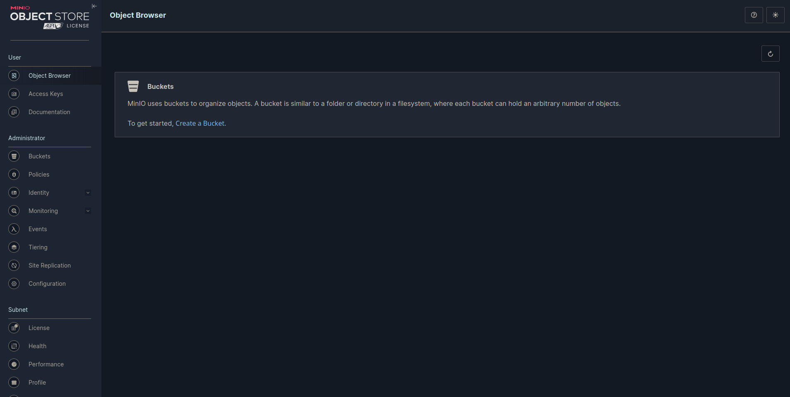

# Personal S3 storage infrastructure

MinIO is a High-Performance Object Storage system released under GNU Affero General Public License v3.0. It is API compatible with the Amazon S3 cloud storage service. In a Multi-Node Multi-Drive (MNMD) or “Distributed” configuration, provides enterprise-grade performance, availability, and scalability and are the recommended topology for all production workloads.

MNMD deployments support erasure configurations which tolerate the loss of up to half the nodes or drives in the deployment while continuing to serve read operations.

<p align="center">
  
</p>

## Prerequisites

Before you begin, ensure you have the following:

- [Hetzner](https://hetzner.cloud/?ref=Ix9xCKNxJriM) Cloud account
- [Terraform](https://www.terraform.io/downloads.html)
- [Ansible](https://docs.ansible.com/ansible/latest/installation_guide/intro_installation.html)

## Deployment Steps

### 1. Generate Hetzner API Token

Create new project in Hetzner [console](https://console.hetzner.cloud/projects)

Obtain API token from Hetzner console that will be used by Terraform to interact with the platform.
Navigate to your project and click on SECURITY > API TOKENS > GENERATE API (give read/write access)

Paste API token in the `.auto.tfvars`. This will overwrite default values in `variables.tf` file.

---

### 2. Configure infrastructure

Choose how many servers you want to have in your cluster. It is recommended to have a minimum of 2 MinIO servers. In this example, we will use 4 servers distributed across all available locations. There are 3 locations in the EU: ["fsn1", "nbg1", "hel1"]. The number of servers and disks per VPS created will rotate around this list. Disks are auto-mounted, with a limit of 16 volumes per server.

Load balancing (LB) is also needed to route requests automatically to nodes in the deployment. A multi-node setup eliminates a single point of failure. For best practices, check the MinIO [documentation](https://min.io/docs/minio/linux/index.html).

```bash
hcloud_token = "xxxxxxxxxxxxxxxxxxxxxxxxxxxxxxxxxxxxxxxxxxxx"

location_list      = ["fsn1", "nbg1", "hel1"]
instances_minio_lb = "1"
instances_minio    = "4"
server_type_minio  = "cx21"
os_type            = "ubuntu-20.04"
volumes_per_node   = "4"
disk_size          = "30"
public_net         = true
```

---

### 3. Initialize and Apply Terraform

Initialize Terraform and apply the configuration:

```shell
cd hetzner-infra
terraform init --upgrade
terraform validate
terraform apply -auto-approve
```

When Terraform finishes with infrastructure creation, you need the private and public server IPs. Public IPs are needed for setting up necessary installation and configuration with Ansible. Private IPs will be used by servers for communication and load balancing for distributing traffic. When the infrastructure is up and running, we can disable public IPs on MinIO instances with Terraform, and the only entry point would be our load balancer
Terraform outputs:

```bash
server_ips = {
  "minio" = {
    "minio-0" = "49.13.73.3"
    "minio-1" = "128.140.0.112"
    "minio-2" = "135.181.88.205"
    "minio-3" = "91.107.208.20"
  }
  "minio_lb" = {
    "minio-lb-0" = "49.13.86.88"
  }
}
server_status = {
  "minio" = {
    "minio-0" = "running"
    "minio-1" = "running"
    "minio-2" = "running"
    "minio-3" = "running"
  }
  "minio_lb" = {
    "minio-lb-0" = "running"
  }
}
```

---

### 4. Configure Minio, Nginx playbooks and Hosts

In your `inventory/hosts` file, specify the IP addresses of your newly created servers obtained from Terraform output, or alternatively, verify them in the Hetzner Cloud console

```shell
[nginx-minio-lb]
49.13.86.88

[minio]
49.13.73.3
128.140.0.112
135.181.88.205
91.107.208.20
```

#### **a) MinIO playbook config**

MinIO requires using expansion notation {x...y} to denote a sequential series of MinIO hosts and volumes when creating a server pool. Other variables are self explanatory:

```bash
vars:
    minio_server_cluster_nodes:
      [
        "https://minio{1...4}.ujstor.com:{{ minio_server_port }}/mnt/disk{1...4}/minio",
      ]

    minio_server_port: "9091"
    minio_console_port: "9092"

    minio_root_user: "ujstor"
    minio_root_password: "roottoor123"

    minio_validate_certificate: true
    minio_alias: "ujstorminio"
```

Another important aspect is defining the volumes per node that will have permissions for the MinIO user and group:

```bash
- name: Change ownership for /mnt/disk
      become: true
      become_user: root
      ansible.builtin.file:
        path: "{{ item }}"
        owner: minio
        group: minio
        state: directory
      with_items:
        - /mnt/disk1
        - /mnt/disk2
        - /mnt/disk3
        - /mnt/disk4
```

#### **b) Preconfig playbook configuration**

In the `folder minio_config`, there is a preconfig playbook. This playbook will create DNS mappings, rename default volume names created by Hetzner, and copy certificates to every node.

First, add hostnames and private IPs:

```bash
  vars:
    dns_mappings:
      - hostname: "minio1.ujstor.com"
        ip_address: "10.0.1.2"
      - hostname: "minio2.ujstor.com"
        ip_address: "10.0.1.3"
      - hostname: "minio3.ujstor.com"
        ip_address: "10.0.1.4"
      - hostname: "minio4.ujstor.com"
        ip_address: "10.0.1.5"
```

Next, navigate to the SSL directory and create a certificate with this command:

```bash
sudo ./certgen-linux-amd64 -host "10.0.1.2, 10.0.1.3, 10.0.1.4, 10.0.1.5, minio1.ujstor.com, minio2.ujstor.com, minio3.ujstor.com, minio4.ujstor.com" && sudo chmod 644 private.key
```

#### **c) Configure Nginx lb**

Nginx variables are pretty straightforward. You need private IPs from servers, ports for console and API defined in the MinIO playbook, and domains that you will register with your DNS provider.

```bash
  vars:
    minio_servers:
      - 10.0.1.2
      - 10.0.1.3
      - 10.0.1.4
      - 10.0.1.5
    minio_port: 9091
    console_port: 9092
    console_domain: minio-console.ujstor.com
    minio_domain: minio.ujstor.com
```

When the playbook is applied, we will create certificates for secure SSL connections using [Certbot](https://certbot.eff.org/instructions?ws=nginx&os=ubuntufocal) for the chosen domains.

---

### 5. Run playbooks

MinIO:

```bash
cd ansible
ansible-playbook playbooks/playbook_minio.yml
```

Expected output:

```bash
PLAY RECAP ********************************************************************************************************
128.140.0.112              : ok=46   changed=29   unreachable=0    failed=0    skipped=3    rescued=0    ignored=3
135.181.88.205             : ok=46   changed=29   unreachable=0    failed=0    skipped=3    rescued=0    ignored=3
49.13.73.3                 : ok=51   changed=31   unreachable=0    failed=0    skipped=7    rescued=0    ignored=3
91.107.208.20              : ok=46   changed=29   unreachable=0    failed=0    skipped=3    rescued=0    ignored=3
```

Nginx:

```bash
ansible-playbook playbooks/playbook_nginx_minio_lb.yml
```

Expected output:

```bash
PLAY RECAP *******************************************************************************************************
49.13.86.88                : ok=29   changed=18   unreachable=0    failed=0    skipped=9    rescued=0    ignored=0
```

Complete terminal output is available in the [public](/public/) directory.

---

## 6. SSH into LB and configure ssl

Terraform creates SSH private and public keys that are added to Hetzner and servers. They are also used by Ansible. Be careful with keys, you don't want to lose them.

SSH into LB with the following command:

```shell
ssh root@49.13.86.88> -i ~/.ssh/minio_hetzner_key.pem
```

Install snap and create cert:

```bash
apt install snapd
snap install --classic certbot
certbot --nginx
```

---

## 7. Open UI and test S3 compatable API

MinIO UI is now available at https://minio-console.ujstor.com. Once you configure buckets and permissions, test the API on https://minio.ujstor.com.

#### Debugging

If there is an issue, you cant access the UI, SSH into one of the servers, and check the logs and systemctl status of the MinIO service

```bash
systemctl status minio.service
cat /var/log/syslog
```

If you see something like this, there is a high chance that volume permissions are not set correctly or there was a problem with the volume rename:

```bash
root@minio-2:~# systemctl status minio.service
● minio.service - MinIO
     Loaded: loaded (/etc/systemd/system/minio.service; enabled; vendor preset: enabled)
     Active: failed (Result: exit-code) since Thu 2024-03-14 22:13:37 UTC; 21min ago
       Docs: https://docs.min.io
    Process: 1062 ExecStartPre=/bin/bash -c if [ -z "${MINIO_VOLUMES}" ]; then echo "Variable MINIO_VOLUMES not set in /etc/minio/minio.conf"; exit 1; fi (code=exited, status=0/SUCCESS)
    Process: 1063 ExecStart=/usr/local/bin/minio server $MINIO_OPTS $MINIO_VOLUMES (code=exited, status=1/FAILURE)
   Main PID: 1063 (code=exited, status=1/FAILURE)

Mar 14 22:13:37 minio-2 systemd[1]: minio.service: Scheduled restart job, restart counter is at 5.
Mar 14 22:13:37 minio-2 systemd[1]: Stopped MinIO.
Mar 14 22:13:37 minio-2 systemd[1]: minio.service: Start request repeated too quickly.
Mar 14 22:13:37 minio-2 systemd[1]: minio.service: Failed with result 'exit-code'.
Mar 14 22:13:37 minio-2 systemd[1]: Failed to start MinIO.
```

Check /mnt/ to see if there are volumes named disk1-4. If they are present, run the MinIO playbook again from the 'Change ownership for /mnt/disk' task:

```bash
ansible-playbook playbooks/playbook_minio.yml --start-at-task="Change ownership for /mnt/disk"
```

This command can be executed manually on every node if you SSH into them:

```bash
chown -R minio:minio /mnt/disk{1,2,3,4}
```

Other common things that can go wrong is DNS resolving, so check /etc/hosts to see if dns_mapping is correst:

```bash
cat /etc/hosts
```

Output:
```bash
cat /etc/hosts
# Your system has configured 'manage_etc_hosts' as True.
# As a result, if you wish for changes to this file to persist
# then you will need to either
# a.) make changes to the master file in /etc/cloud/templates/hosts.debian.tmpl
# b.) change or remove the value of 'manage_etc_hosts' in
#     /etc/cloud/cloud.cfg or cloud-config from user-data
#
127.0.1.1 minio-2 minio-2
127.0.0.1 localhost

# The following lines are desirable for IPv6 capable hosts
::1 localhost ip6-localhost ip6-loopback
ff02::1 ip6-allnodes
ff02::2 ip6-allrouters

10.0.1.2 minio1.ujstor.com
10.0.1.3 minio2.ujstor.com
10.0.1.4 minio3.ujstor.com
10.0.1.5 minio4.ujstor.com
```

Let's assume that everything is working fine. You now have a login UI. Use the username and password defined in the Minio playbook. Congratulations! Your personal S3-compatible storage is up and running, ready to use.


<div style="display: flex; justify-content: center;">
    
    
</div>

---


### 8. Destroy infrastructure

To destroy the infrastructure run the following command:

```shell
terraform destroy -auto-approve
```