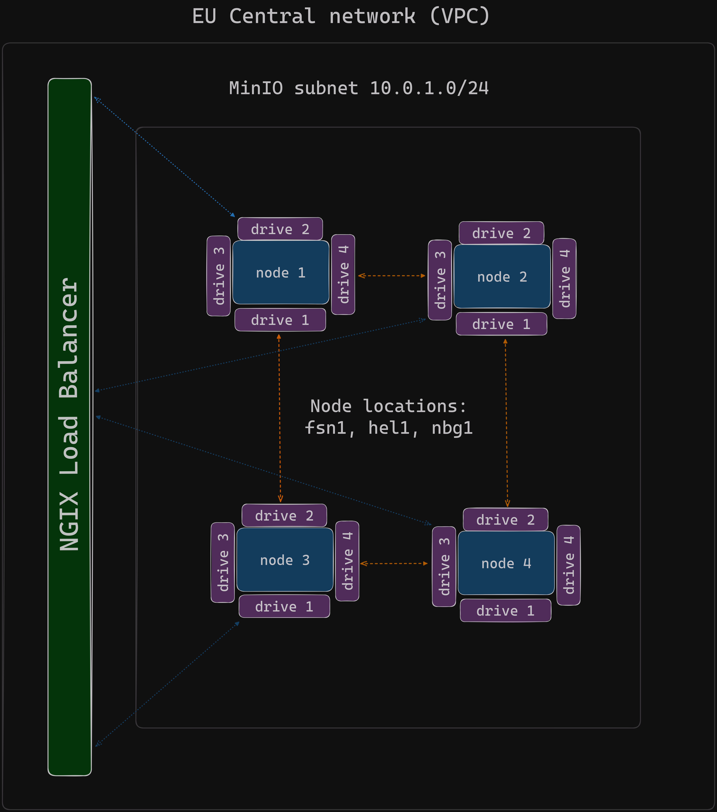

# Personal S3 storage infrastructure

MinIO in a Multi-Node Multi-Drive (MNMD) or “Distributed” configuration. MNMD deployments provide enterprise-grade performance, availability, and scalability and are the recommended topology for all production workloads.

MNMD deployments support erasure coding configurations which tolerate the loss of up to half the nodes or drives in the deployment while continuing to serve read operations.

